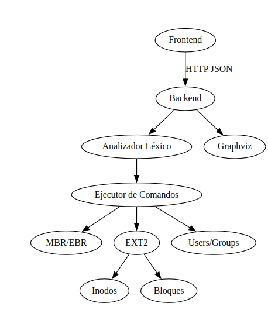
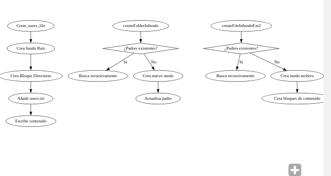

# Manual Técnico del Sistema de Archivos EXT2 Simulado


## 1. Introducción

Este manual técnico describe la arquitectura, tecnologías utilizadas y funcionamiento del backend y frontend desarrollados para el procesamiento de comandos mediante una API REST.

## 2. Tecnologías Utilizadas

### Backend
- **Lenguaje:** Go
- **Framework:** Fiber
- **Middleware:** CORS
- **Dependencias:**
  - `github.com/gofiber/fiber/v2`
  - `github.com/gofiber/fiber/v2/middleware/cors`

### Frontend
- **Framework:** React con Vite
- **Lenguaje:** TypeScript
- **Librerías:**
  - React Hooks (`useState`, `useRef`)
  - Fetch API
  - Tailwind CSS

## 3. Arquitectura del Sistema
El sistema sigue una arquitectura cliente-servidor, donde el frontend envía comandos al backend, este los procesa y devuelve los resultados.

### 3.1. Backend
El backend es un servidor API REST construido con Fiber en Go. Sus responsabilidades incluyen:
- Recibir y procesar comandos enviados en formato JSON.
- Analizar el comando usando el paquete `analizador`.
- Retornar los resultados en formato JSON.

#### 3.1.1. Instalación y Ejecución
1. Instalar Go.
2. Instalar las dependencias ejecutando:
   ```sh
   go mod tidy

   Ejecutar el servidor:

    go run main.go

#### 3.1.2. Endpoints

    POST /analyze

        Descripción: Recibe un comando en JSON, lo analiza y devuelve los resultados.

        Entrada: { "command": "texto del comando" } 

        Salida{ "results": ["resultado 1", "resultado 2"] }

### 3.2. Frontend
El frontend es una aplicación React con Vite. Su función es proporcionar una interfaz gráfica para ingresar comandos y visualizar los resultados.

#### 3.2.1. Instalación y Ejecución

   1. Instalar Node.js y npm.

   2. Instalar las dependencias:

    

       - npm install

       - Ejecutar el frontend:

       - npm run dev


#### 3.2.2. Funcionalidades

- Entrada de comandos en un `textarea`.
- Carga de archivos de texto.
- Envío de comandos al backend y visualización de resultados.

### 3.3. Flujo de Datos

1. El usuario ingresa un comando en el frontend.
2. El frontend envía el comando al backend a través de un `POST /analyze`.
3. El backend analiza el comando y devuelve los resultados.
4. El frontend muestra los resultados en pantalla.

### 3.4. Consideraciones de Seguridad

- Se usa middleware CORS para evitar problemas de origen cruzado.
- Se valida el formato JSON de las solicitudes.

## 4. Estructuras claves 

#### 4.1 Estructura MBR (Master Boot Record)

-
    ```go
    type MBR struct {
        mbr_tamano        int32     // 4 bytes
        mbr_fecha_creacion [19]byte // Formato: "YYYY-MM-DD HH:MM:SS"
        mbr_dsk_signature int32     // UUID del disco
        dsk_fit           byte      // 'B'/'F'/'W'
        mbr_partitions    [4]Partition
    }

| Campo                | Tipo         | Tamaño             | Descripción                                                                 |
|----------------------|--------------|--------------------|-----------------------------------------------------------------------------|
| `mbr_tamano`         | `int32`      | 4 bytes            | Tamaño del disco                                                           |
| `mbr_fecha_creacion` | `[19]byte`   | 19 bytes           | Fecha de creación (formato "YYYY-MM-DD HH:MM:SS")                          |
| `mbr_dsk_signature`  | `int32`      | 4 bytes            | Identificador único del disco (UUID)                                       |
| `dsk_fit`            | `byte`       | 1 byte             | Tipo de ajuste ('B'=Best, 'F'=First, 'W'=Worst)                            |
| `mbr_partitions`     | `[4]Partition` | 128 bytes (4x32)  | Arreglo de 4 particiones primarias/extendidas  |   

--- 
### Estructura Partition

-
    ```go
    type Partition struct {
        part_status byte     // 0=Inactiva, 1=Activa
        part_type   byte     // 'P'/'E'/'L'
        part_fit    byte     // Ajuste
        part_start  int32    // Byte inicial
        part_s      int32    // Tamaño en bytes
        part_name   [16]byte // Nombre de partición
        part_id     [4]byte  // Ej: "341A"
    }

| Campo          | Tipo        | Tamaño  | Descripción                     | Valores posibles                     |
|----------------|-------------|---------|---------------------------------|--------------------------------------|
| `part_status`  | `byte`      | 1 byte  | Estado de la partición          | `0`=Inactiva, `1`=Activa             |
| `part_type`    | `byte`      | 1 byte  | Tipo de partición               | `'P'`=Primaria, `'E'`=Extendida, `'L'`=Lógica |
| `part_fit`     | `byte`      | 1 byte  | Algoritmo de ajuste             | `'B'`=Best, `'F'`=First, `'W'`=Worst |
| `part_start`   | `int32`     | 4 bytes | Byte inicial de la partición

### Estructura SuperBlock

-
    ```go
    type SuperBlock struct {
        s_inodes_count      int32   // Número total de inodos
        s_blocks_count      int32   // = 3 * inodes_count
        s_free_inodes_count int32   // Inodos libres
        s_free_blocks_count int32   // Bloques libres
        s_mtime            [19]byte // Último montaje (formato: "YYYY-MM-DD HH:MM:SS")
        s_magic            int16    // Número mágico (0xEF53 para EXT)
        s_inode_size       int16    // Tamaño de inodo en bytes
    }

| Campo                | Tipo     | Tamaño  | Descripción                          | Valor Típico          |
|----------------------|----------|---------|--------------------------------------|-----------------------|
| `s_inodes_count`     | `int32`  | 4 bytes | Total de inodos                      | Variable              |
| `s_blocks_count`     | `int32`  | 4 bytes | Total de bloques (3×inodos)          | 3 × inodos           |
| `s_free_inodes_count`| `int32`  | 4 bytes | Inodos libres                        | ≤ total inodos       |
| `s_free_blocks_count`| `int32`  | 4 bytes | Bloques libres                       | ≤ total bloques      |
| `s_mtime`            | `[19]byte`| 19 bytes| Último montaje (YYYY-MM-DD HH:MM:SS)| "2023-11-15 14:30:00"|
| `s_magic`            | `int16`  | 2 bytes | Magic number del FS                  | 0xEF53               |
| `s_inode_size`       | `int16`  | 2 bytes | Tamaño de un inodo                   | 128 bytes            |

### Estructura Inode

-
    ```go
    type Inode struct {
        i_uid    int32      // 4 bytes - ID usuario propietario
        i_gid    int32      // 4 bytes - ID grupo propietario
        i_size   int32      // 4 bytes - Tamaño en bytes
        i_atime  [19]byte   // 19 bytes - Último acceso (YYYY-MM-DD HH:MM:SS)
        i_ctime  [19]byte   // 19 bytes - Creación/cambio (YYYY-MM-DD HH:MM:SS)
        i_block  [15]int32  // 60 bytes (15×4) - Bloques de datos
        i_type   byte       // 1 byte - Tipo (0=Directorio, 1=Archivo)
        i_perm   int16      // 2 bytes - Permisos (ej: 0777 en octal)
    }

### Diagramas de flujo 


Imagen2. diagrama de flujo funcionamiento

**Fuente:** elaboración propia, 2025

Imagen2. diagrama de flujo

**Fuente:** elaboración propia, 2025